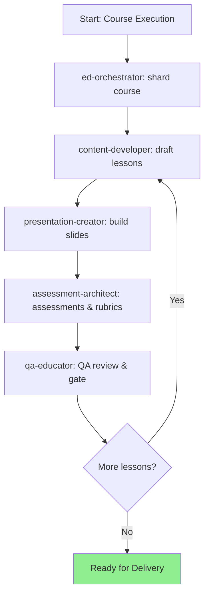

# AURA — User Guide

AURA (**Agentic Unified Reinforcement for Academics**) is an AI agent framework for **designing, developing, and assuring quality** of educational programs.

---

## The Plan → Execute Model

Planning is usually done first (optionally on the web with heavy models), then **execution** happens in the IDE using specialized agents.

### Planning Artifacts (standard paths)

```
Course Spec           → docs/courses/{course_slug}.md
Outcomes Map (O→A→T)  → docs/outcomes/{course_slug}-map.md
```

### Execution Artifacts (per lesson)

```
Lesson Script         → docs/lessons/{course_slug}/{lesson_id}.md
Slides                → docs/slides/{course_slug}/{lesson_id}.md
Assessment            → docs/assessments/{course_slug}/{lesson_id}-assessment.md
Rubric                → docs/rubrics/{course_slug}/{lesson_id}-rubric.md
QA Gate               → docs/qa/gates/{course_slug}-{lesson_id}.yml
```

---

## Roles & When to Use

- **ed orchestrator** — shards the course and coordinates stages
- **educational designer** — course structure, outcomes, modules
- **content developer** — lesson scripts, examples, activities
- **presentation creator** — slides & visuals (accessibility by default)
- **assessment architect** — assessments & rubrics aligned to Bloom
- **learning curve specialist** — pacing & scaffolding checks
- **qa educator** — quality gate: alignment, accessibility, NFR education

---

## Core Execution Flow



---

## Quick Commands

```bash
@ed-orchestrator *shard-course
@content *develop-lesson {lesson_id}
@slides *slides {lesson_id}
@assess *test-design {lesson_id}
@qa *review {lesson_id}
@qa *gate {lesson_id}
```

---

## Accessibility & Inclusivity

- Follow `.aura-core/data/accessibility-standards.md`
- Provide alt text and transcripts
- Maintain high contrast and minimum font sizes
- Use inclusive language and representative examples

---

## Troubleshooting

- **Gaps in coverage?** Run `@qa *trace-learning {course_slug}`
- **Too dense lesson?** `@content *refine` to reduce cognitive load
- **Pacing issues?** Engage the **learning curve specialist**
- **Conflicting artifacts?** Re‑run orchestrator & re align outcomes map
